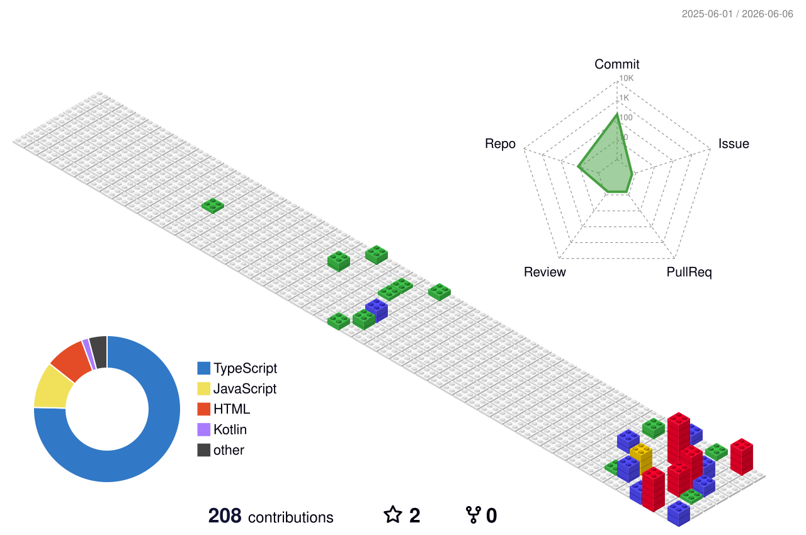

<div align="center">

  <!-- Cute Typing Header -->
  [](https://git.io/typing-svg)

  <sub>🇮🇩 East Java, Indonesia &nbsp;•&nbsp; 🌐 <a href="https://gunturafandy.my.id">gunturafandy.my.id</a></sub>

</div>

&nbsp;

```js
const guntur = {
    role: "Full Stack Developer",
    status: "🧸 Cozy coding & building digital worlds",
    currentProject: "Chloera Digital Store 🍊",
    love: ["Next.js", "React", "TypeScript", "Node.js"],
    hobby: ["Gaming 🎮", "Anime 🌸", "Designing 🎨"]
};
```

&nbsp;

<!-- 3D Animated Contribution Graph (Cute block style) -->
<div align="center">
  <picture>
    <source media="(prefers-color-scheme: dark)" srcset="./profile-3d-contrib/profile-gitblock.svg" />
    <source media="(prefers-color-scheme: light)" srcset="./profile-3d-contrib/profile-south-season-animate.svg" />
    
  </picture>
</div>

&nbsp;

<!-- Tech Stack -->
<details open>
<summary><b>🌸 Tech Stack</b></summary>
<br>

<div align="center">

| Frontend | Backend | Mobile & Tools |
|:--------:|:-------:|:--------------:|
|      |     |     |

</div>
</details>

<!-- Stats -->
<details open>
<summary><b>📊 Stats</b></summary>
<br>

<div align="center">
  
  
</div>

<br>

<div align="center">
  
</div>

</details>

<!-- Projects -->
<details open>
<summary><b>🚀 Projects</b></summary>
<br>

<div align="center">
  <a href="https://github.com/callmezext/portfolio">
    
  </a>&nbsp;
  <a href="https://github.com/callmezext/absensi-karyawan">
    
  </a>
</div>
<br>
<div align="center">
  <a href="https://github.com/callmezext/App-Learn-Nihonggo">
    
  </a>&nbsp;
  <a href="https://github.com/callmezext/runeclipy-bot-discord">
    
  </a>
</div>

</details>

&nbsp;

<!-- Connect -->
<div align="center">

  [](https://gunturafandy.my.id)&nbsp;
  [](https://linkedin.com/in/gunturafandyx)&nbsp;
  [](https://instagram.com/gunturafandyx)&nbsp;
  [](mailto:gunturafandy7@gmail.com)

</div>

<!-- Snake Animation -->
<div align="center">
  <picture>
    <source media="(prefers-color-scheme: dark)" srcset="./profile-3d-contrib/github-snake-dark.svg" />
    <source media="(prefers-color-scheme: light)" srcset="./profile-3d-contrib/github-snake.svg" />
    
  </picture>
</div>

<div align="center">

  

</div>
